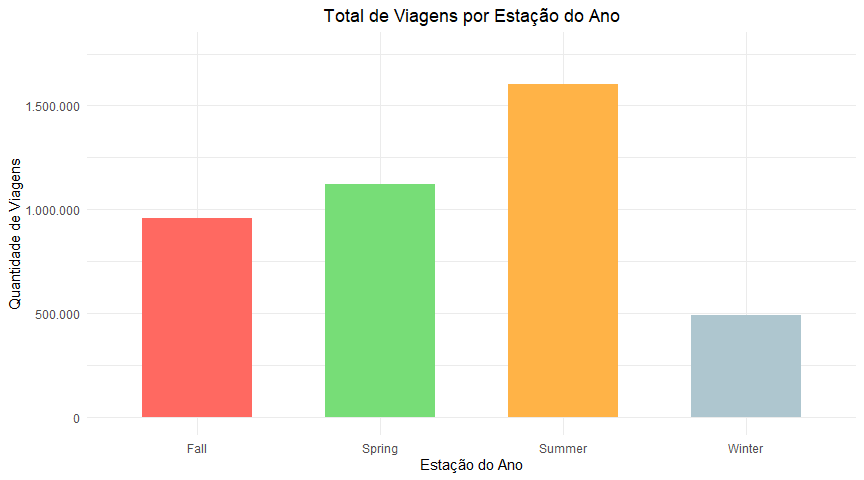
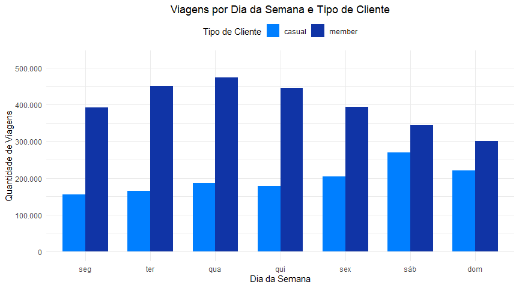
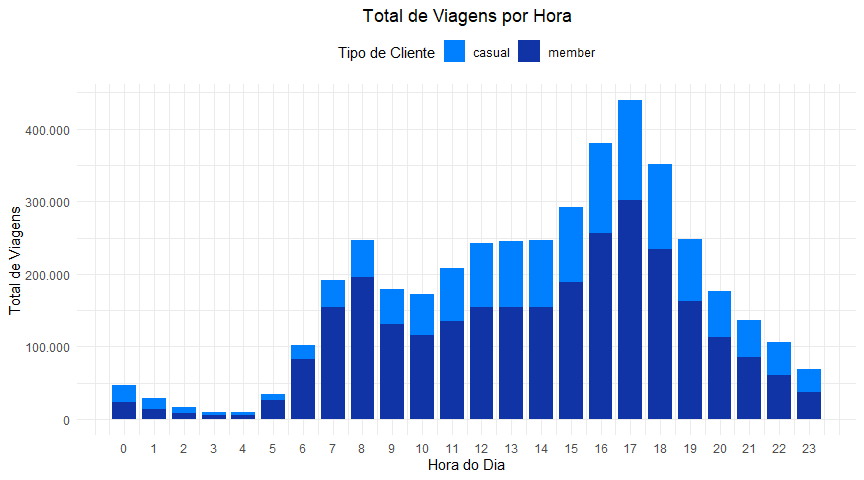
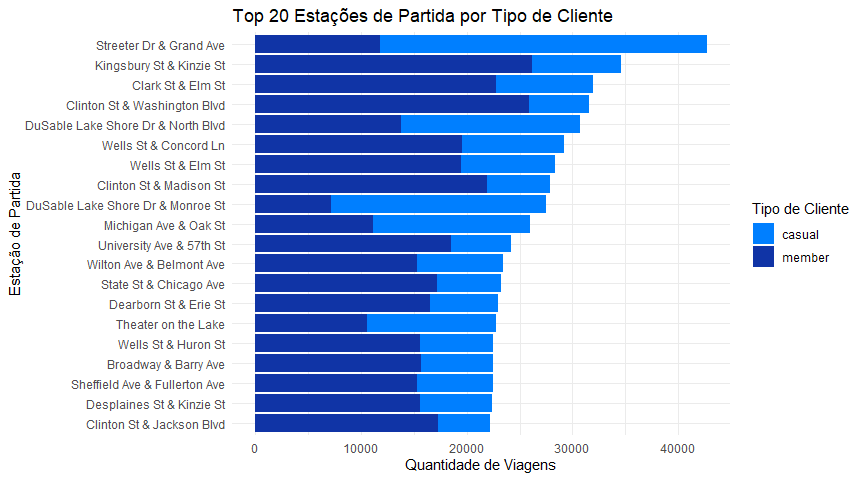

Maximizando Assinaturas Anuais na Cyclistic: Uma Análise de Dados de
Bicicletas Compartilhadas
================
Rodrigo Felisberto
2024-09-14

**Contato:**

Email: <rodrigo.fdlira@gmail.com>  
LinkedIn:
[linkedin.com/in/rodrigofdl/](https://www.linkedin.com/in/rodrigofdl/)

# Contexto

A Cyclistic, uma empresa de compartilhamento de bicicletas baseada em
Chicago, tem sido um caso de sucesso desde sua criação em 2016. Com uma
frota de mais de 5.800 bicicletas e 600 estações de ancoragem, a empresa
se destaca por oferecer uma variedade de opções inclusivas, como
bicicletas reclináveis e triciclos de mão. Essas inovações tornam o
serviço acessível para pessoas com deficiência, além de atender
ciclistas que buscam opções além da bicicleta tradicional.

Atualmente, a Cyclistic enfrenta o desafio de maximizar o número de
assinaturas anuais, visto que os membros anuais geram mais receita do
que os ciclistas casuais, que optam por passes de viagem única ou
diária. A diretora de marketing, Lily Moreno, acredita que a chave para
o crescimento da empresa reside na conversão de ciclistas casuais em
membros anuais. Para desenvolver uma estratégia de marketing eficaz, é
fundamental entender as diferenças de comportamento entre esses dois
grupos de usuários e identificar como os ciclistas casuais podem ser
incentivados a adotar um plano de assinatura anual.

# Objetivo

- Esse relatório visa responder a seguinte pergunta: Como os membros
  anuais e os ciclistas casuais usam as bicicletas Cyclistic de forma
  diferente?

# Fontes de Dados

Foram utilizados dados históricos de viagem da Cyclistic dos últimos 12
meses. De agosto de 2023 a julho de 2024. Os dados podem ser acessados
no seguinte link: [Download the previous 12 months of Cyclistic trip
data here.](https://divvy-tripdata.s3.amazonaws.com/index.html)

# Limpeza e Manipulação dos Dados

Pacotes carregados:

``` r
library(tidyverse)   # Manipulação e visualização
library(lubridate)   # Manipulação de datas/horas
library(janitor)     # Limpeza de dados
library(scales)      # Formatação de números/escalas
library(geosphere)   # Cálculos geoespaciais
library(forcats)     # Manipulação de fatores
```

Carregamento e agregação dos dados:

``` r
# Definir o caminho da pasta onde os arquivos estão armazenados
folder_path <- "C:/Users/rodri/Documents/cyclistic_bike_share/dados/"

# Criar uma lista com os nomes dos arquivos
file_names <- paste0("2023", sprintf("%02d", 8:12), "-divvy-tripdata.csv") # de Agosto a Dezembro de 2023
file_names <- c(file_names, paste0("2024", sprintf("%02d", 1:7), "-divvy-tripdata.csv")) # de Janeiro a Julho de 2024

# Criar uma função para ler os arquivos CSV
read_csv_files <- function(file) {
  read.csv(paste0(folder_path, file))
}

# Utilizar lapply para ler todos os arquivos de forma eficiente
bike_trips_list <- lapply(file_names, read_csv_files)

# Combinar todos os datasets em um único dataframe
bike_trips <- do.call(rbind, bike_trips_list)
```

Limpeza e transformação dos dados:

``` r
# Remover linhas e colunas vazias
clean_trips <- bike_trips %>% 
  remove_empty(c("rows", "cols")) %>% 
  filter(start_station_name != "")  # Filtrar viagens com estação de partida preenchida

# Criar nova coluna 'trip_date' convertendo 'started_at' para Date
clean_trips$trip_date <- as.Date(clean_trips$started_at)

# Converter 'started_at' e 'ended_at' para tipo datetime e calcular a duração em minutos
clean_trips <- clean_trips %>%
  mutate(
    started_at = ymd_hms(started_at),
    ended_at = ymd_hms(ended_at),
    trip_duration_min = difftime(ended_at, started_at, units = "mins"),
    start_hour = hour(started_at), 
    trip_duration_min = as.numeric(trip_duration_min)
  ) %>%
  filter(trip_duration_min > 0) # Filtrar viagens com duração positiva
  
# Renomear colunas para clareza
clean_trips <- clean_trips %>%
  rename(bike_type = rideable_type, 
         user_type = member_casual)

# Criar coluna 'season' para indicar a estação com base na data
clean_trips <- clean_trips %>%
  mutate(
    season = case_when(
      (trip_date >= as.Date("2023-06-21") & trip_date <= as.Date("2023-09-22")) ~ "Summer",
      (trip_date >= as.Date("2023-09-23") & trip_date <= as.Date("2023-12-20")) ~ "Fall",
      (trip_date >= as.Date("2023-12-21") & trip_date <= as.Date("2024-03-19")) ~ "Winter",
      (trip_date >= as.Date("2024-03-20") & trip_date <= as.Date("2024-06-20")) ~ "Spring",
      (trip_date >= as.Date("2024-06-21") & trip_date <= as.Date("2024-09-22")) ~ "Summer",
      TRUE ~ "Unknown"  # Ajuste para tratar valores fora dos intervalos definidos
    )
  )

# Criar coluna 'weekday' para indicar o dia da semana
clean_trips <- clean_trips %>%
  mutate(weekday = wday(trip_date, label = TRUE, abbr = TRUE, week_start = 1))

# Calcular a distância percorrida usando coordenadas geográficas (fórmula de Haversine)
clean_trips$distance_m <- distHaversine(
  cbind(clean_trips$start_lng, clean_trips$start_lat), 
  cbind(clean_trips$end_lng, clean_trips$end_lat))
```

Tratamento de outliers

``` r
# Função para remover outliers de uma variável com base no IQR
remove_outliers <- function(data, column) {
  # Calcular o primeiro e terceiro quartil
  Q1 <- quantile(data[[column]], 0.25, na.rm = TRUE)
  Q3 <- quantile(data[[column]], 0.75, na.rm = TRUE)
  IQR <- Q3 - Q1  # Intervalo interquartil
  
  # Definir limites inferior e superior para outliers
  lower_bound <- Q1 - 1.5 * IQR
  upper_bound <- Q3 + 1.5 * IQR
  
  # Filtrar dados dentro dos limites
  filtered_data <- data %>%
    filter(data[[column]] >= lower_bound & data[[column]] <= upper_bound)
  
  return(filtered_data)
}

# Aplicar função para remover outliers nas colunas 'trip_duration_min' e 'distance_m'
clean_trips <- clean_trips %>%
  remove_outliers("trip_duration_min") %>%
  remove_outliers("distance_m")

# Visualizar a estrutura do dataframe
glimpse(clean_trips)
```

    ## Rows: 4,178,013
    ## Columns: 19
    ## $ ride_id            <chr> "903C30C2D810A53B", "F2FB18A98E110A2B", "D0DEC7C94E…
    ## $ bike_type          <chr> "electric_bike", "electric_bike", "electric_bike", …
    ## $ started_at         <dttm> 2023-08-19 15:41:53, 2023-08-18 15:30:18, 2023-08-…
    ## $ ended_at           <dttm> 2023-08-19 15:53:36, 2023-08-18 15:45:25, 2023-08-…
    ## $ start_station_name <chr> "LaSalle St & Illinois St", "Clark St & Randolph St…
    ## $ start_station_id   <chr> "13430", "TA1305000030", "TA1305000030", "KA1504000…
    ## $ end_station_name   <chr> "Clark St & Elm St", "", "", "", "", "", "", "", ""…
    ## $ end_station_id     <chr> "TA1307000039", "", "", "", "", "", "", "", "", "",…
    ## $ start_lat          <dbl> 41.89072, 41.88451, 41.88498, 41.90310, 41.88555, 4…
    ## $ start_lng          <dbl> -87.63148, -87.63155, -87.63079, -87.63467, -87.632…
    ## $ end_lat            <dbl> 41.90297, 41.93000, 41.91000, 41.90000, 41.89000, 4…
    ## $ end_lng            <dbl> -87.63128, -87.64000, -87.63000, -87.62000, -87.680…
    ## $ user_type          <chr> "member", "member", "member", "member", "member", "…
    ## $ trip_date          <date> 2023-08-19, 2023-08-18, 2023-08-30, 2023-08-30, 20…
    ## $ trip_duration_min  <dbl> 11.716667, 15.116667, 12.483333, 9.450000, 20.90000…
    ## $ start_hour         <int> 15, 15, 16, 16, 15, 12, 20, 15, 21, 14, 17, 8, 17, …
    ## $ season             <chr> "Summer", "Summer", "Summer", "Summer", "Summer", "…
    ## $ weekday            <ord> sáb, sex, qua, qua, ter, qui, qui, qui, qui, seg, q…
    ## $ distance_m         <dbl> 1363.9466, 5111.9331, 2785.8952, 1263.4070, 4007.02…

# Resumo da Análise / Insights Obtidos

#### **Distribuição de viagens por tipo de cliente**

- 67% das viagens são feitas por membros anuais.
- Clientes casuais são os únicos que utilizam bicicletas atracadas.

#### **Padrões sazonais e climáticos**

- O número de viagens tende a aumentar com a chegada das semanas de
  verão, principalmente nos meses de março e junho (primavera).
- No verão, há um número muito maior de viagens em comparação com outras
  estações do ano.
- O número de viagens tende a diminuir com a chegada das semanas de
  inverno, principalmente nos meses de novembro e dezembro (outono).
- No inverno, há um número muito menor de viagens em comparação com
  outras estações do ano.

#### **Comportamento dos clientes por dia da semana**

- Clientes casuais fazem mais viagens nos finais de semana, com pico aos
  sábados.
- Clientes anuais fazem mais viagens durante a semana, especialmente de
  terça a quinta-feira, com pico nas quartas-feiras.

#### **Padrões de horário**

- No geral, ambos os tipos de clientes fazem mais viagens durante a
  tarde, com pico entre 16h e 18h.

#### **Estações mais populares**

- A estação inicial com a maior quantidade de viagens é a “Streeter Dr &
  Grand Ave”.
- Dentre as 20 estações iniciais mais populares, 5 têm mais clientes
  casuais que anuais: Streeter Dr & Grand Ave, DuSable \* Lake Shore Dr
  & North Blvd, DuSable Lake Shore Dr & Monroe St, Michigan Ave & Oak
  St, e Theater on the Lake.

#### **Duração e distância das viagens**

- A duração média (minutos) das viagens de clientes casuais é maior que
  a dos clientes anuais.
- Embora clientes anuais tenham uma duração média (minutos) menor, a
  distância média (metros) percorrida por eles é maior.
- Clientes que utilizam bicicletas atracadas apresentam a maior duração
  média (minutos).

# Visualizações

``` r
# Contar clientes por tipo e calcular porcentagem
customer_counts <- clean_trips %>%
  count(user_type) %>%
  mutate(percent = n / sum(n) * 100)

# Definindo a paleta personalizada com azul celeste, azul egípicio e amarelo fogo
custom_palette <- c("#007FFF", "#1034A6", "#ffae42") 

# Criar gráfico de pizza para visualização do número de clientes
ggplot(customer_counts, aes(x = "", y = n, fill = user_type)) + 
  geom_bar(width = 1, stat = "identity") + 
  coord_polar(theta = "y") + 
  labs(title = "Distribuição de Clientes por Tipo",
       fill = "Tipo de Clientes") + 
  geom_text(aes(label = paste0(n, " viagens\n(", round(percent, 1), "%)")), 
            position = position_stack(vjust = 0.5), 
            color = "white") + 
  scale_fill_manual(values = custom_palette) + 
  theme_void()
```

<!-- -->

``` r
# Agrupar os dados por tipo de cliente e tipo de bicicleta, contando as corridas
rides_summary <- clean_trips %>%
  group_by(user_type, bike_type) %>%
  summarise(total_rides = n(), .groups = "drop")

# Criar gráfico de barras para mostrar a quantidade de corridas por tipo de bicicleta e cliente
ggplot(rides_summary, aes(x = fct_reorder(bike_type, total_rides), y = total_rides, fill = user_type)) + 
  geom_col(position = "dodge", width = 0.7) + 
  scale_y_continuous(labels = label_comma(big.mark = ".", decimal.mark = ","), 
                     limits = c(0, max(rides_summary$total_rides) * 1.1)) +
  labs(title = "Viagem por Tipo de Bicicleta e Perfil de Cliente", 
       x = "Tipo de Bicicleta", 
       y = "Quantidade de Viagens", 
       fill = "Tipo de Cliente") + 
  scale_fill_manual(values = custom_palette) + 
  theme_minimal()
```

<!-- -->

``` r
# Agrupar dados por tipo de cliente, tipo de bicicleta, semana e hora de início, contando as viagens
weekly_summary <- clean_trips %>% 
  group_by(user_type, bike_type, start_hour, week = floor_date(trip_date, "week")) %>% 
  summarise(
    trip_count = n(),
    .groups = "drop"
  )

# Visualizar estrutura e resumo estatístico do dataframe
glimpse(weekly_summary)
```

    ## Rows: 5,206
    ## Columns: 5
    ## $ user_type  <chr> "casual", "casual", "casual", "casual", "casual", "casual",…
    ## $ bike_type  <chr> "classic_bike", "classic_bike", "classic_bike", "classic_bi…
    ## $ start_hour <int> 0, 0, 0, 0, 0, 0, 0, 0, 0, 0, 0, 0, 0, 0, 0, 0, 0, 0, 0, 0,…
    ## $ week       <date> 2023-07-30, 2023-08-06, 2023-08-13, 2023-08-20, 2023-08-27…
    ## $ trip_count <int> 357, 400, 513, 451, 327, 393, 528, 508, 315, 311, 147, 185,…

``` r
summary(weekly_summary)
```

    ##   user_type          bike_type           start_hour         week           
    ##  Length:5206        Length:5206        Min.   : 0.00   Min.   :2023-07-30  
    ##  Class :character   Class :character   1st Qu.: 6.00   1st Qu.:2023-10-22  
    ##  Mode  :character   Mode  :character   Median :12.00   Median :2024-01-21  
    ##                                        Mean   :11.50   Mean   :2024-01-24  
    ##                                        3rd Qu.:17.75   3rd Qu.:2024-04-28  
    ##                                        Max.   :23.00   Max.   :2024-07-28  
    ##    trip_count    
    ##  Min.   :   1.0  
    ##  1st Qu.: 147.0  
    ##  Median : 513.0  
    ##  Mean   : 802.5  
    ##  3rd Qu.:1202.0  
    ##  Max.   :5746.0

``` r
# Criar gráfico de barras mostrando a contagem de passeios por semana
ggplot(weekly_summary) + 
  geom_col(aes(x = week, y = trip_count, fill = user_type)) + 
  scale_x_date(date_breaks = "1 month", date_labels = "%b") + 
  scale_y_continuous(labels = label_comma(big.mark = ".", decimal.mark = ",")) + 
  labs(title = "Frequência de Passeios Semanal por Tipo de Cliente", 
       subtitle = "Agosto de 2023 a Julho de 2024", 
       x = "Semanas", 
       y = "Número de Passeios", 
       fill = "Tipo de Cliente") + 
  scale_fill_manual(values = custom_palette) + 
  theme_minimal()
```

<!-- -->

``` r
# Definindo a paleta personalizada com azul celeste, azul egípicio e amarelo fogo
custom_palette_2 <- c("#FF6961", "#77DD77", "#FFB347", "#AEC6CF") 

# Agrupar dados por estação do ano e contar o número total de passeios
seasonal_trips <- clean_trips %>%
  group_by(season) %>%
  summarise(trip_count = n(), .groups = "drop")

# Criar gráfico de barras mostrando o total de passeios por estação do ano
ggplot(seasonal_trips, aes(x = season, y = trip_count, fill = season)) +
  geom_col(width = 0.6) + 
  scale_y_continuous(labels = label_comma(big.mark = ".", decimal.mark = ","), 
                     limits = c(0, max(seasonal_trips$trip_count) * 1.1)) +  
  labs(title = "Total de Viagens por Estação do Ano", 
       x = "Estação do Ano", 
       y = "Quantidade de Viagens") + 
  theme_minimal() + 
  scale_fill_manual(values = custom_palette_2) + 
  theme(legend.position = "none") + 
  theme(plot.title = element_text(hjust = 0.5))
```

<!-- -->

``` r
# Agrupar corridas por dia da semana e tipo de cliente, contando o número de viagens
trips_by_day_customer <- clean_trips %>%
  group_by(weekday, user_type) %>%
  summarise(trip_count = n(), .groups = "drop")

# Gerar gráfico de barras mostrando o total de corridas por dia da semana e tipo de cliente
ggplot(trips_by_day_customer, aes(x = weekday, y = trip_count, fill = user_type)) +
  geom_col(position = "dodge", width = 0.7) +  # Lado a lado ("dodge")
  scale_y_continuous(labels = label_comma(big.mark = ".", decimal.mark = ","), 
                     limits = c(0, max(trips_by_day_customer$trip_count) * 1.1)) +  
  labs(title = "Viagens por Dia da Semana e Tipo de Cliente", 
       x = "Dia da Semana", 
       y = "Quantidade de Viagens", 
       fill = "Tipo de Cliente") + 
  scale_fill_manual(values = custom_palette) + 
  theme_minimal() +  
  theme(legend.position = "top",  
        plot.title = element_text(hjust = 0.5)) 
```

<!-- -->

``` r
# Gráfico de barras mostrando a contagem de viagens por hora do dia e tipo de cliente
ggplot(weekly_summary) + 
  geom_col(aes(x = start_hour, y = trip_count, fill = user_type), width = 0.8) +  
  scale_y_continuous(labels = label_comma(big.mark = ".", decimal.mark = ",")) +  
  scale_x_continuous(breaks = 0:23) +  
  labs(title = "Total de Viagens por Hora", 
       x = "Hora do Dia", 
       y = "Total de Viagens", 
       fill = "Tipo de Cliente") + 
  scale_fill_manual(values = custom_palette) + 
  theme_minimal() +  
  theme(legend.position = "top",  
        plot.title = element_text(hjust = 0.5))
```

<!-- -->

``` r
# Identificar as 20 estações de partida mais frequentes
top_start_stations <- clean_trips %>%
  count(start_station_name, sort = TRUE) %>% 
  slice_max(n, n = 20)

# Filtrar os dados para conter apenas as 20 estações mais frequentes
filtered_trips <- clean_trips %>%
  filter(start_station_name %in% top_start_stations$start_station_name) %>% 
  left_join(top_start_stations, by = "start_station_name") %>% 
  mutate(start_station_name = fct_reorder(start_station_name, n))

# Criar gráfico de barras horizontal mostrando as 20 estações mais frequentes
ggplot(filtered_trips) +
  geom_bar(aes(x = start_station_name, fill = user_type)) + 
  coord_flip() + 
  labs(title = "Top 20 Estações de Partida por Tipo de Cliente", 
       x = "Estação de Partida", 
       y = "Quantidade de Viagens", 
       fill = "Tipo de Cliente") + 
  scale_fill_manual(values = custom_palette) + 
  theme_minimal()
```

<!-- -->

``` r
# Agrupar dados por tipo de cliente, tipo de bicicleta, semana e hora de início, calculando estatísticas de distância e duração
stats_summary <- clean_trips %>%
  group_by(user_type, bike_type, weekly = floor_date(trip_date, "week")) %>%
  summarise(
    sum_distance = sum(distance_m, na.rm = TRUE),
    avg_distance = mean(distance_m, na.rm = TRUE),
    median_distance = median(distance_m, na.rm = TRUE),
    max_distance = max(distance_m, na.rm = TRUE),
    min_distance = min(distance_m, na.rm = TRUE),
    sd_distance = sd(distance_m, na.rm = TRUE),
    sum_duration = sum(trip_duration_min, na.rm = TRUE),
    avg_duration = mean(trip_duration_min, na.rm = TRUE),
    median_duration = median(trip_duration_min, na.rm = TRUE),
    max_duration = max(trip_duration_min, na.rm = TRUE),
    min_duration = min(trip_duration_min, na.rm = TRUE),
    sd_duration = sd(trip_duration_min, na.rm = TRUE),
    trip_count = n(),
    .groups = "drop"
  )

# Criar de dispersão que compara a distância percorrida e duração das corridas por tipo de cliente
ggplot(stats_summary, aes(x = avg_distance, y = avg_duration, color = user_type)) +
  geom_point(size = 2, alpha = 0.75) + 
  geom_smooth(method = "lm", se = FALSE, linetype = "dashed", color = "black") + 
  labs(title = "Comparação entre Distância Percorrida e Duração das Corridas",
       x = "Distância Média Percorrida (metros)",
       y = "Duração Média (minutos)",
       color = "Tipo de Cliente") + 
  scale_color_manual(values = custom_palette) + 
  theme_minimal() +  
  theme(legend.position = "top",  
        plot.title = element_text(hjust = 0.5))
```

    ## `geom_smooth()` using formula = 'y ~ x'

<!-- -->

``` r
# Definindo a paleta personalizada com azul egípicio, amarelo fogo e azul celeste
custom_palette_3 <- c("#007FFF", "#ffae42", "#1034A6") 

ggplot(stats_summary, aes(x = avg_distance, y = avg_duration, color = bike_type)) +
  geom_point(size = 2, alpha = 0.75) + 
  geom_smooth(method = "lm", se = FALSE, linetype = "dashed", color = "black") + 
  labs(title = "Comparação entre Distância Percorrida e Duração das Corridas",
       x = "Distância Média Percorrida (metros)",
       y = "Duração Média (minutos)",
       color = "Tipo de Cliente") + 
  scale_color_manual(values = custom_palette_3) + 
  theme_minimal() +  
  theme(legend.position = "top",  
        plot.title = element_text(hjust = 0.5))
```

    ## `geom_smooth()` using formula = 'y ~ x'

<!-- -->

# Recomendações

#### **Oferecer Promoções e Benefícios Exclusivos da Assinatura Anual Durante o Verão e Primavera**

- Justificativa: O número de viagens aumenta durante a primavera e
  atinge o pico no verão, quando tanto clientes anuais quanto casuais
  estão mais ativos.

- Ação: Aproveitar esse período para promover descontos ou benefícios
  exclusivos para a conversão de clientes casuais em anuais, oferecendo
  preços promocionais em assinaturas anuais durante as semanas de pico
  de utilização, como março a junho. Além disso, destacar os benefícios
  de ser um membro anual, como descontos em viagens mais longas e acesso
  facilitado às bicicletas, pode ajudar na conversão.

#### **Criar Campanhas Focadas nos Finais de Semana e e Locais Turísticos**

- Justificativa: Clientes casuais fazem mais viagens nos finais de
  semana, principalmente aos sábados, e utilizam estações de partida
  próximas a áreas turísticas.

- Ação: Implementar campanhas específicas nas estações mais utilizadas
  por clientes casuais (como Streeter Dr & Grand Ave e DuSable Lake
  Shore Dr & North Blvd) que incentivem a assinatura anual, destacando
  vantagens como economia para uso contínuo, acesso rápido e
  conveniência. Oferecer testes gratuitos de curto prazo ou pacotes
  promocionais para clientes casuais durante o fim de semana também pode
  incentivar a conversão.

#### **Enfatizar a Economia ao Utilizar uma Assinatura Anual para Clientes Casuais (Principalmente ao Utilizar Bicicletas Atracadas)**

- Justificativa: A duração média das viagens de clientes casuais é
  maior, o que significa que eles poderiam economizar optando por uma
  assinatura anual. E também propor uma promoção para utilizar
  bicicletas atracadas, visto que clientes casuais são os únicos que as
  utilizam.

- Ação: Usar mensagens personalizadas que demonstrem o quanto esses
  clientes casuais poderiam economizar em viagens de longa duração e
  bicicletas atracadas ao se tornarem membros anuais. Esse tipo de
  abordagem, focada no valor e na economia, pode ser feita via
  aplicativos, e-mails ou diretamente nas estações com alta utilização
  de bicicletas atracadas.

# Conclusão

A análise dos dados de viagens da Cyclistic revela importantes
distinções entre os comportamentos dos clientes casuais e membros
anuais. Enquanto os membros anuais realizam a maior parte das viagens,
representando 67% do total, os clientes casuais se destacam pelo uso de
bicicletas atracadas e uma maior duração média das viagens. Em termos de
padrões sazonais, observou-se um aumento significativo no número de
viagens durante o verão, enquanto o inverno apresentou uma redução
notável. Além disso, há diferenças nos hábitos diários, com clientes
casuais preferindo os finais de semana e os membros anuais optando por
dias úteis. A Cyclistic tem a oportunidade de usar essas informações
para personalizar suas campanhas de marketing utilizar de estratégias de
upselling para maximizar a conversão de usuários casuais em membros
anuais.
